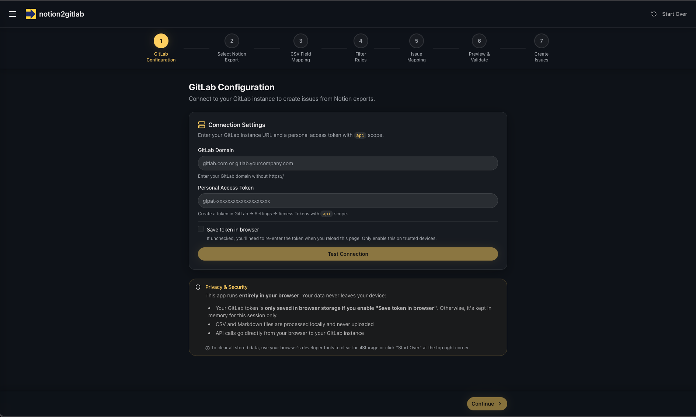

# notion2gitlab

> **Convert Notion Database Exports to GitLab Issues** — A free, open-source tool to migrate your Notion tasks, tickets, and records into GitLab issues with full control over field mapping.

[](LICENSE)

---

## What is notion2gitlab?

**notion2gitlab** is a browser-based tool that converts exported Notion databases (CSV + Markdown) into GitLab issues. Perfect for teams migrating from Notion to GitLab for project management, or anyone who wants to bulk-import structured data into GitLab.

## The problem?

Notion database exports lack consistency due to user-defined column names, varying property types, and flexible database structures.

### Use Cases

- **Migrate Notion task boards** to GitLab issue trackers
- **Import product backlogs** from Notion databases to GitLab projects
- **Bulk-create GitLab issues** from spreadsheet-like Notion exports
- **Preserve rich descriptions** by linking Notion's Markdown exports to issues

---

### Privacy & Security

**100% Client-Side Processing** — Your data never leaves your browser:

- GitLab tokens are stored in browser localStorage only if configured
- CSV and Markdown files are processed locally
- API calls go directly from your browser to your GitLab instance
- No server, no tracking, no data collection

---

## Quick Start

### Prerequisites

- Node.js 18+
- A GitLab account with a [Personal Access Token](https://docs.gitlab.com/ee/user/profile/personal_access_tokens.html) (requires `api` scope)
- A Notion database exported as CSV + Markdown

### Export from Notion

1. Open your Notion database
2. Click `•••` → **Export** → **Markdown & CSV**
3. Unzip the downloaded file

### Run notion2gitlab

```bash
# Clone the repository
git clone https://github.com/YOUR_USERNAME/notion2gitlab.git
cd notion2gitlab

# Install dependencies
npm install

# Start development server
npm run dev
```

Open [http://localhost:3000](http://localhost:3000) and follow the wizard.

---

## GitLab Token Permissions

Create a Personal Access Token in GitLab with the following scope:

| Scope | Required | Purpose                      |
| ----- | -------- | ---------------------------- |
| `api` | Yes      | Create issues, list projects |

**How to create a token:**

1. GitLab → Settings → Access Tokens
2. Create token with `api` scope
3. Copy the token (starts with `glpat-`)

---

## FAQ

### What Notion export format is supported?

notion2gitlab works with Notion's **Markdown & CSV** export format. Each database row can have an associated Markdown file containing the page content.

### Can I import to multiple GitLab projects?

Yes! You can either:

- Map a CSV column containing project paths (e.g., `group/project-name`)
- Set a default repository for all issues
- Mix both: use column values with a fallback default

### Is my GitLab token safe?

Your token is stored in your browser's localStorage and never sent to any server. All GitLab API calls are made directly from your browser to your GitLab instance.

### What happens if import fails mid-way?

You can pause/resume the import at any time. Already-created issues remain in GitLab. Export the results CSV to see which issues succeeded or failed.

---

## Contributing

Contributions are welcome! Please feel free to submit a Pull Request.

---

## License

MIT License — see [LICENSE](LICENSE) for details.

---

## Keywords

notion to gitlab, notion database export, gitlab issues import, notion migration tool, csv to gitlab issues, bulk create gitlab issues, notion gitlab integration, project management migration, notion export converter, gitlab issue importer
